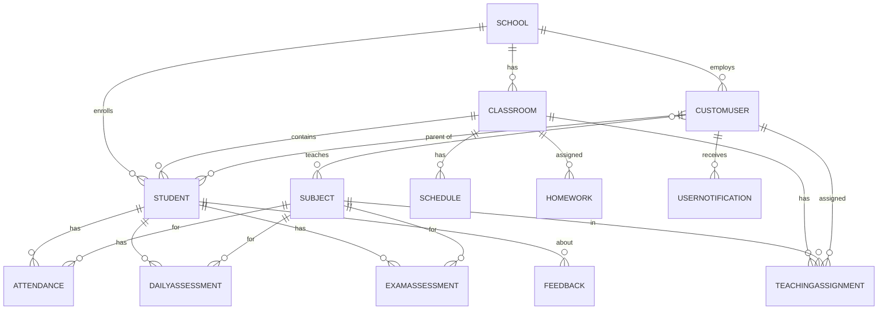

# EduTrace

A school management backend built with **Django REST Framework** and **PostgreSQL**. EduTrace keeps school data (students, attendance, grades, homework, schedules, feedback) in one relational database and exposes it through a documented REST API secured with JWT authentication.

The project focuses on **relational database design** and on turning raw school records into data that can be queried, aggregated and analysed.

## Features

- **Accounts and roles** (Teacher, Parent, Admin) with JWT authentication, email verification and invitation codes
- **Schools, classrooms and teaching assignments** modelled with foreign keys and many-to-many relations
- **Attendance tracking** per student, subject and date
- **Assessments**: daily scores and semester exams (small/big summative, annual final)
- **Homework, schedule, feedback and announcements** between teachers, parents and administrators
- **Real-time notifications** over WebSockets (Django Channels + Redis) stored in the database
- **Background tasks** with Celery and Redis (emails, bulk notifications)
- **Interactive API documentation** (Swagger UI and ReDoc via drf-yasg)

## Tech stack

| Area | Tools |
|---|---|
| Language / framework | Python, Django 5.2, Django REST Framework |
| Database | PostgreSQL |
| Authentication | JWT (djangorestframework-simplejwt) |
| Async tasks | Celery, Redis, django-celery-results |
| Real-time | Django Channels, channels-redis |
| API docs | drf-yasg (Swagger / ReDoc) |
| Deployment | Gunicorn, WhiteNoise, python-decouple |

## Project structure

```
EduTrace/          settings, ASGI/WSGI, Celery app
accounts/          users, roles, invitations, authentication
schools/           schools, classrooms, teaching assignments
students/          students
subjects/          subjects
schedule/          weekly class schedule
attendance/        attendance records
assessments/       daily and exam scores
homeworks/         homework assignments
feedbacks/         teacher-to-parent feedback
announcements/     announcements by target group
notifications/     stored + real-time notifications
templates/         email templates
```

## Database design

The schema is relational and normalized. Data from different apps is linked through foreign keys, so attendance, grades and classroom data can be combined with `JOIN`s. Integrity is enforced at the database level with `unique_together` and conditional unique constraints (for example, only one "big summative" exam per student, subject and semester).



### Example analytical queries

The structure makes it easy to answer analytical questions directly in SQL.

**Attendance rate per student**

```sql
SELECT s.id,
       s.first_name || ' ' || s.last_name AS student,
       ROUND(100.0 * COUNT(*) FILTER (WHERE a.status = 'PRESENT') / COUNT(*), 1) AS attendance_pct
FROM students_student s
JOIN attendance_attendance a ON a.student_id = s.id
GROUP BY s.id, s.first_name, s.last_name
ORDER BY attendance_pct;
```

**Average exam score per subject and classroom**

```sql
SELECT c.name AS classroom,
       sub.name AS subject,
       ROUND(AVG(e.score)::numeric, 2) AS avg_score
FROM assessments_examassessment e
JOIN subjects_subject sub ON sub.id = e.subject_id
JOIN schools_classroom c ON c.id = e.classroom_id
GROUP BY c.name, sub.name
ORDER BY c.name, avg_score DESC;
```

**Students with more than 20% absences (at-risk students)**

```sql
SELECT s.id, s.first_name, s.last_name,
       COUNT(*) FILTER (WHERE a.status = 'ABSENT') AS absences,
       COUNT(*) AS total_lessons
FROM students_student s
JOIN attendance_attendance a ON a.student_id = s.id
GROUP BY s.id, s.first_name, s.last_name
HAVING COUNT(*) FILTER (WHERE a.status = 'ABSENT') * 1.0 / COUNT(*) > 0.2;
```

**Student ranking inside each classroom (window function)**

```sql
SELECT classroom_id, student_id, avg_score,
       RANK() OVER (PARTITION BY classroom_id ORDER BY avg_score DESC) AS rank_in_class
FROM (
    SELECT classroom_id, student_id, AVG(score) AS avg_score
    FROM assessments_examassessment
    GROUP BY classroom_id, student_id
) t;
```

## Getting started

### Requirements

- Python 3.10+
- PostgreSQL
- Redis (Celery broker and Channels layer)

### Installation

```bash
git clone https://github.com/elizadelacin/edutrace.git
cd edutrace

python -m venv venv
source venv/bin/activate        # Windows: venv\Scripts\activate

pip install -r requirements.txt
```

### Configuration

Create a `.env` file in the project root:

```env
SECRET_KEY=your-secret-key
DEBUG=True
ALLOWED_HOSTS=localhost,127.0.0.1

DB_NAME=edutrace
DB_USER=postgres
DB_PASSWORD=your-password
DB_HOST=localhost
DB_PORT=5432

REDIS_URL=redis://localhost:6379/0
SITE_URL=http://localhost:8000

EMAIL_BACKEND=django.core.mail.backends.console.EmailBackend
EMAIL_HOST=smtp.example.com
EMAIL_PORT=587
EMAIL_USE_TLS=True
EMAIL_HOST_USER=you@example.com
EMAIL_HOST_PASSWORD=your-email-password
DEFAULT_FROM_EMAIL=you@example.com
```

### Run

```bash
python manage.py migrate
python manage.py createsuperuser
daphne EduTrace.asgi:application     # serves HTTP and WebSockets
```

In a separate terminal, start the Celery worker:

```bash
celery -A EduTrace worker -l info
```

## API documentation

After starting the server:

- Swagger UI: `http://localhost:8000/swagger/`
- ReDoc: `http://localhost:8000/redoc/`

## What I learned

- Designing a normalized PostgreSQL schema with clear relationships and database-level constraints
- Writing efficient queries with the Django ORM and reasoning about the SQL behind it
- Building secured, documented REST APIs with role-based access
- Moving slow work out of the request cycle with Celery and Redis, and pushing live updates over WebSockets

## Author

**Lachin Alizade**
[GitHub](https://github.com/elizadelacin) | [LinkedIn](https://linkedin.com/in/lachin-alizade)
